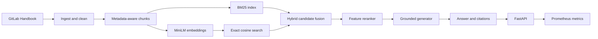

# Enterprise RAG Assistant

A production-style enterprise knowledge assistant built with retrieval-augmented
generation. It ingests a bounded public GitLab Handbook corpus, preserves
document metadata, combines dense and lexical search, reranks results, and
returns grounded answers with source citations.

The complete default workflow is local and free. Answer synthesis uses a
deterministic extractive generator; an optional Ollama adapter connects a local
open-weight LLM without sending enterprise text to a paid API.

## Architecture



## What is implemented

- Versioned ingestion, extraction, cleaning, chunking, and metadata propagation.
- Normalized 384-dimensional `all-MiniLM-L6-v2` embeddings and persisted cosine index.
- BM25 plus dense candidate retrieval, reciprocal-rank fusion, metadata filters,
  and a feature-based reranker.
- Offline Recall@K, MRR@K, and NDCG@K evaluation.
- Grounded answer generation with numbered citations and an explicit no-evidence response.
- Optional local Ollama generation with a citation-constrained prompt.
- FastAPI retrieval and answer endpoints with validation, optional API-key auth,
  rate limiting, readiness checks, and Prometheus metrics.
- Docker deployment, concurrent latency benchmark, answer-quality evaluation,
  unit tests, and GitHub Actions validation.

## Quick start

```bash
make install
make corpus
make index
make test
make serve
```

The first embedding run downloads the free Apache-2.0 licensed MiniLM model.
Open [the API documentation](http://localhost:8000/docs) after starting the server.

Ask a question:

```bash
curl -s http://localhost:8000/v1/answer \
  -H 'Content-Type: application/json' \
  -d '{"question":"How should open-source dependencies be secured?","department":"security"}'
```

The response contains the answer, ranked citations, generator name, and retrieval,
generation, and end-to-end latency.

## API

| Endpoint | Purpose |
|---|---|
| `GET /health` | Process liveness without loading the model |
| `GET /ready` | Model and index readiness |
| `POST /v1/retrieve` | Ranked evidence chunks with metadata filters |
| `POST /v1/answer` | Grounded answer, citations, and timing |
| `GET /metrics` | Prometheus-format service metrics |

Set `RAG_API_KEY` to require an `X-API-Key` header. Requests are limited to 60
per client per minute by default; change `RATE_LIMIT_PER_MINUTE` if needed.

## Optional local LLM

Install Ollama separately, pull a small model, and select the adapter:

```bash
ollama pull llama3.2:3b
GENERATOR=ollama OLLAMA_MODEL=llama3.2:3b make serve
```

The default extractive mode remains useful for deterministic evaluation and
machines that cannot hold a generative model.

## Evaluation

```bash
make evaluate
make evaluate-hybrid
make evaluate-answers
make benchmark
```

The 26-query retrieval set is checked in and human-readable. Generated reports
are written to `data/reports/`. Current measured retrieval results:

| Metric | Dense baseline | Hybrid + reranking | Relative lift |
|---|---:|---:|---:|
| Recall@1 | 0.6731 | 0.8654 | +28.57% |
| NDCG@1 | 0.6923 | 0.8846 | +27.78% |
| Recall@10 | 0.9615 | 1.0000 | +4.00% |
| MRR@10 | 0.8013 | 0.9295 | +16.00% |
| NDCG@10 | 0.8415 | 0.9473 | +12.57% |

Hybrid index lookup measured 1.37 ms mean and 1.61 ms p95 locally, excluding
query embedding and generation. See [docs/RESULTS.md](docs/RESULTS.md) for scope
and limitations. The completed answer path achieved 100% expected-source recall,
100% citation coverage and validity, and 87.5% expected-keyword recall on the
four-case answer smoke set. A 20-request, concurrency-4 localhost run achieved
66.12 requests/second with 59.49 ms mean and 80.94 ms p95 end-to-end latency.
These are development measurements, not production service-level objectives.

## Docker

Build the corpus and index first, then launch the API:

```bash
cp .env.example .env
make docker-up
curl http://localhost:8000/health
make docker-down
```

The index is mounted read-only. Model and API startup are lazy so `/health`
works before the larger embedding model is loaded; `/ready` performs the load.

## Data and responsible-use notes

Source content remains owned by GitLab and each record retains its source URL
and repository revision. Generated corpus files, embeddings, model caches, and
evaluation reports are intentionally excluded from Git. The included evaluation
set is a development set rather than an independent blind test, so its reported
lift should not be presented as a universal production guarantee.

The project code is available under the [MIT License](LICENSE). Source documents
retain their original ownership and licensing.
